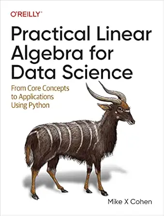

# Practical Linear Algebra: Summary Notes

**Original Author:** Mike X Cohen

This repository contains a collection of Jupyter Notebooks summarizing practical concepts and implementations of linear algebra tailored for data science. These notes are structured to provide hands-on examples of applying mathematical methods using Python, bridging the gap between theoretical linear algebra equations and their implementation in code.

## 📂 Repository Structure

The summaries are divided into 15 main modules that follow the learning path of the repository:

* **`01_Introduction.ipynb`**
    An introduction to the core concepts of linear algebra and setting up the computational environment.
* **`02_Vectors_Part1.ipynb`**
    Fundamentals of vectors, including scalars, vector addition, scalar multiplication, and their geometric interpretations.
* **`03_Vectors_Part2.ipynb`**
    Advanced vector operations, exploring dot products, cross products, vector length, and orthogonal vectors.
* **`04_Vector_Applications.ipynb`**
    Practical applications of vector operations in data science, including correlation and similarity measures.
* **`05_Matrices_Part1.ipynb`**
    Introduction to matrices, matrix dimensions, special types of matrices (identity, zeros, diagonal), and basic matrix arithmetic.
* **`06_Matrices_Part2.ipynb`**
    Deep dive into matrix multiplication, matrix transposition, and understanding matrices as linear transformations.
* **`07_Matrix_Applications.ipynb`**
    Real-world applications of matrices in data manipulation, image processing, and transformations.
* **`08_Matrix_Inverse.ipynb`**
    Understanding and computing the matrix inverse, conditions for invertibility (singular matrices), and using pseudo-inverses.
* **`09_Orthogonal_Matrices_and_QR_Decomposition.ipynb`**
    Exploring the properties of orthogonal matrices and step-by-step implementation of QR decomposition.
* **`10_Row_Reduction_and_LU_Decomposition.ipynb`**
    Techniques for solving systems of equations using Gaussian elimination, row echelon form, and LU decomposition.
* **`11_General_Linear_Models_and_Least_Squares.ipynb`**
    Setting up general linear models (GLMs) and finding optimal solutions using the least squares method.
* **`12_Least_Squares_Applications.ipynb`**
    Applying least squares to solve practical regression, curve fitting, and predictive modeling problems.
* **`13_Eigendecomposition.ipynb`**
    Finding eigenvalues and eigenvectors, understanding their geometric significance, and diagonalizing matrices.
* **`14_SVD.ipynb`**
    Singular Value Decomposition (SVD) mechanics, components of SVD, and its role in data approximation.
* **`15_Perspectives_and_Applications.ipynb`**
    Concluding thoughts, tying concepts together, and advanced applications of linear algebra in machine learning (like PCA).

## 🛠️ System Requirements

To run the `.ipynb` files in this repository, it is recommended to set up a Python environment with the following libraries:
* `numpy`
* `scipy`
* `matplotlib`
* `sympy`
* `jupyter`

---

## ⚠️ Disclaimer

This repository was created purely as personal study notes and a summary focusing on practical linear algebra for data science. 

All concepts, theoretical frameworks, and the general flow of the material discussed herein remain the intellectual property of their respective original authors. This repository is not intended to serve as a substitute for formal educational material, but rather as a syntax reference and a supplementary code summary. For a comprehensive and in-depth understanding of the subject matter, it is highly recommended to refer to standard textbooks like **"Practical Linear Algebra for Data Science"** by Mike X Cohen.
